# Open Design Chat Architecture

This document describes the Open Design chat architecture in portable terms.
It intentionally avoids source-code file references so it can be copied into
another project without requiring access to the Open Design repository.

## Big Picture

Open Design has three main runtime surfaces:

- The web interface where users create projects, chat with agents, inspect
  generated files, and preview outputs.
- The local daemon that owns persistence, project files, agent process
  orchestration, provider proxying, prompt assembly, streaming, and file
  watching.
- Shared contracts that keep request, response, and streaming event shapes
  consistent between the web interface and daemon.

There are two chat execution paths:

- Local agent mode: the daemon launches a local CLI agent and streams its
  output back to the web interface.
- Direct provider mode: the web interface streams directly or through daemon
  proxy endpoints to a model provider using the user's API key.

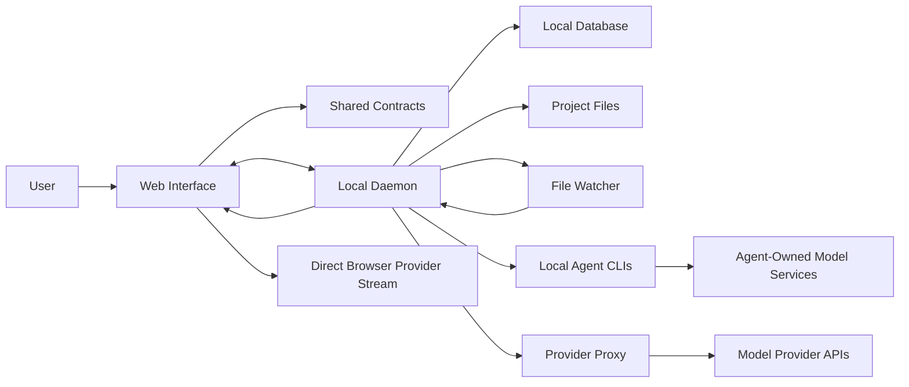

## Core Responsibilities

| Area | Owner | Responsibility |
| --- | --- | --- |
| Chat UI | Web interface | Composer, messages, tool cards, retry, stop, feedback |
| Project workspace | Web interface | File tabs, previews, comments, live artifacts |
| Active run state | Local daemon | Run ids, process handles, SSE clients, cancellation |
| Persistent state | Local daemon | Projects, conversations, messages, settings, tabs |
| Prompt assembly | Local daemon and shared contracts | Skills, design systems, memory, metadata, user request |
| Local agents | Local daemon | CLI detection, env, args, stdin, stdout parsing |
| Direct providers | Web interface plus daemon proxy | API-key streaming, provider-specific protocol mapping |
| Files | Local daemon | File CRUD, raw serving, artifact writes, rename/delete |
| Live reload | Daemon watcher plus web preview | Detect file changes and refresh previews |
| Event protocol | Shared contracts | Stable event shapes across daemon and web |

## Local Agent Chat Flow

In local agent mode, the daemon is the execution host. The web interface only
creates the run, streams events, and renders the result.

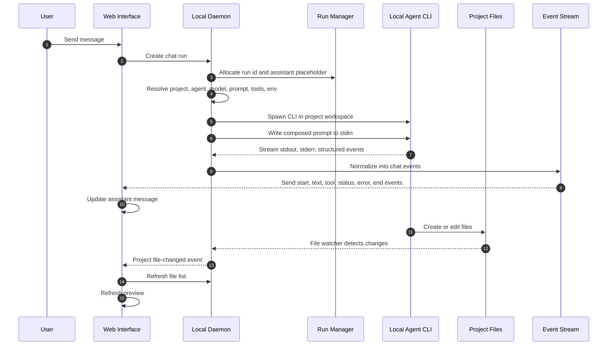

## Direct Provider Chat Flow

In direct provider mode, no local CLI agent is spawned. The web interface builds
an API-mode prompt and streams from a provider.

Some providers stream directly from the browser. Others go through daemon proxy
routes because their protocols need server-side normalization, CORS handling, or
provider-specific stream parsing.

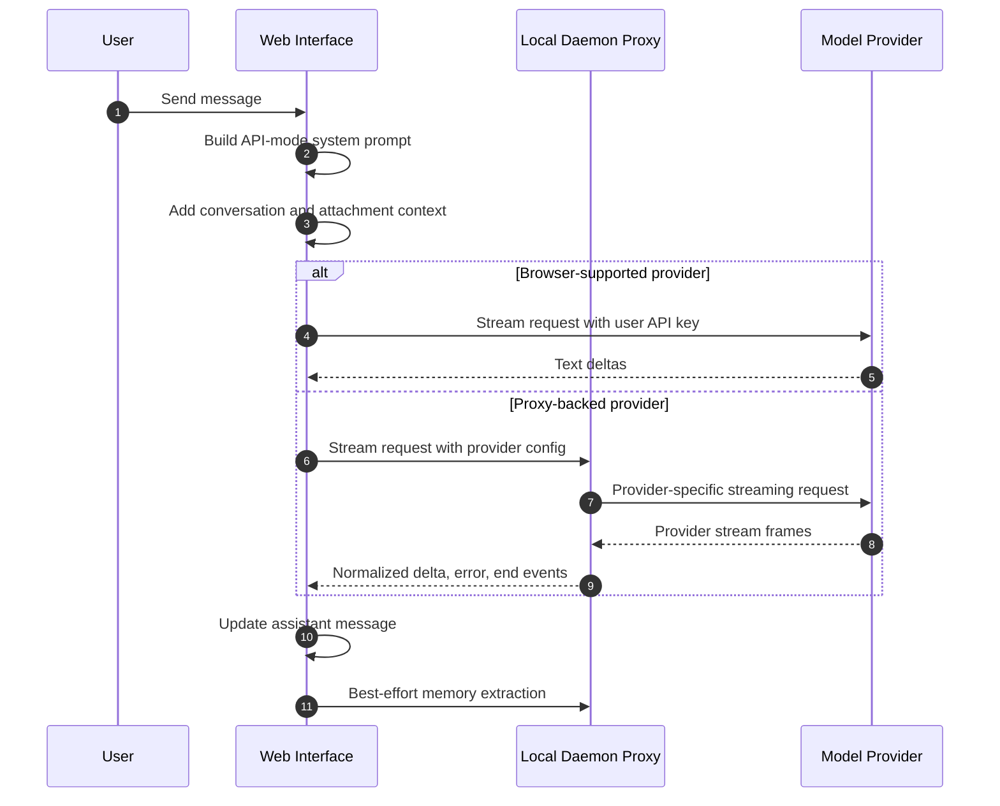

## Prompt Assembly

Prompt assembly has two variants:

- Local agent mode uses daemon-side prompt assembly because the daemon knows the
  project, runtime, skills, design systems, plugin state, filesystem paths,
  media policy, external tools, and agent-specific capabilities.
- Direct provider mode uses a shared prompt composer from the web side and adds
  a plain-mode rule that tells the model that no local tools are available.

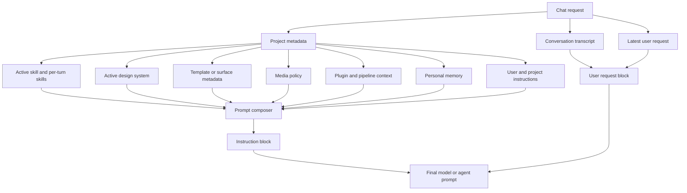

The instruction block can include:

- product and workflow identity
- discovery and planning rules
- active skill instructions
- active design-system rules and tokens
- craft guidance
- memory and custom instructions
- plugin context
- deck or media output contracts
- external tool availability
- safety rules for role markers and duplicate question output
- current working directory and attachment context in local agent mode

## Streaming Event Model

Different agents and providers emit different stream formats. Open Design
normalizes them before rendering.

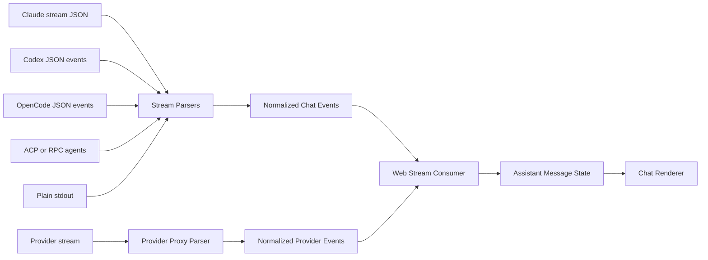

The normalized chat stream contains events like:

- run started
- text delta
- thinking delta
- status update
- tool use
- tool result
- live artifact created, updated, or deleted
- usage summary
- stderr diagnostics
- error
- run ended

The web interface maps these events into a single assistant message. Text deltas
become message content. Tool events become tool cards. Usage becomes footer
metadata. Errors become status events and retry affordances.

## Run Lifecycle

A run is the durable unit of chat execution. It has a stable id, status,
timestamps, associated project/conversation/message ids, event history, and
optional child process state.

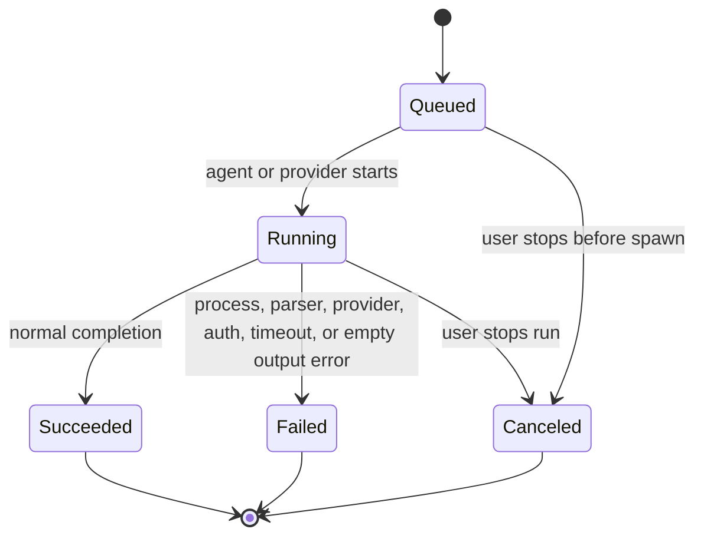

Run behavior:

- Creating a run also creates or pins the assistant placeholder message.
- Events are kept in run memory while active.
- SSE clients can replay missed events using the last seen event id.
- Terminal runs send a final end event and close streams.
- The web can reattach to active runs after navigation or reload.
- Cancellation is routed through the daemon so the child process or agent
  session is stopped centrally.

## Tool And Interactive Question Flow

Tool rendering is separate from tool execution. The UI renders tool-use and
tool-result events, but the local agent runtime or daemon tools perform the
actual work.

AskUserQuestion is a special host-interactive case:

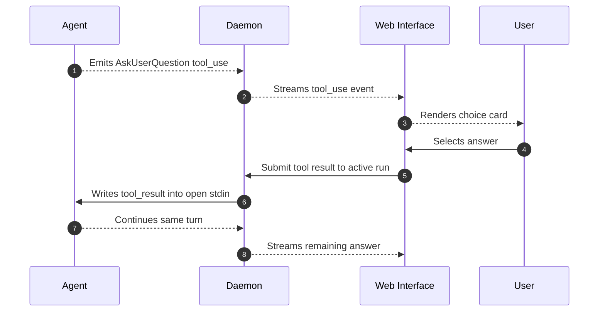

If the live tool-result route is no longer available, the UI falls back to
sending the answer as a normal follow-up message. This prevents the user from
being stuck on an old interactive card.

## File Edit And Preview Update Flow

Open Design treats project files as the source of truth for generated outputs.
When an agent edits files, preview refresh is driven by the filesystem and file
metadata, not by parsing assistant text.

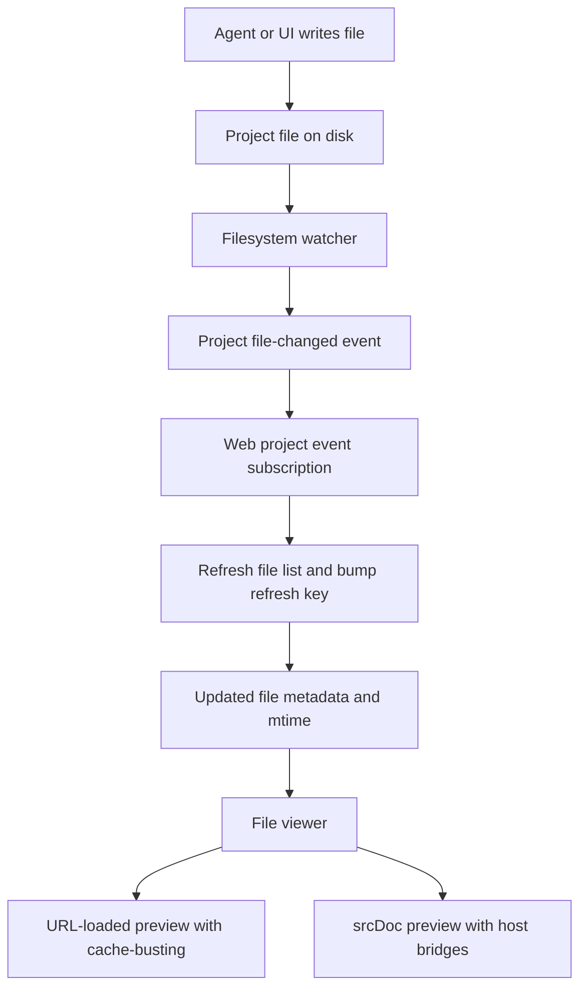

File operations can happen through:

- a local CLI agent writing directly in the project workspace
- a daemon tool endpoint
- a file upload or generated artifact save
- manual edit or inspect-mode save from the web UI
- rename or delete actions from the file workspace

The preview path chooses between two render modes:

- URL-load preview: best when the file can be served directly and browser asset
  resolution should behave naturally.
- srcDoc preview: used when Open Design needs to inject bridges, comments,
  inspect/edit/draw behavior, sandbox shims, or other host-controlled behavior.

Both render modes are driven by refreshed file metadata and cache-busting keys,
so changes appear without requiring a full project reload.

## Chat UI Structure

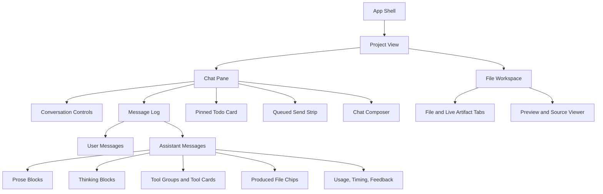

The main orchestration lives at project-view level because sending a chat
message can affect many parts of the workspace:

- conversation messages
- active run controllers
- produced files
- artifacts
- preview refresh
- comments and attachments
- live artifacts
- project metadata
- retry and cancellation state

The chat pane stays focused on rendering and user interaction. It delegates
actual send, retry, stop, file-open, feedback, and settings actions upward.

## State Management

Open Design uses a pragmatic state model:

- React state for live UI state.
- Browser local storage for user-facing web preferences and direct-provider
  configuration.
- Daemon persistence for projects, conversations, messages, tabs, telemetry
  preferences, selected local agent, skills, design systems, and daemon-owned
  settings.
- In-memory daemon run state for currently active runs.
- Filesystem state for generated project outputs.

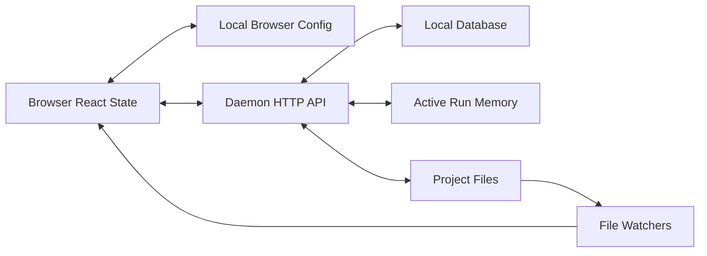

Important state boundaries:

- The web interface can stay rendered when daemon calls fail; many helpers fail
  soft and return empty or null values.
- Active runs are in daemon memory, but their visible output is also persisted
  into assistant messages as events.
- Reattach uses persisted run ids and daemon run status to recover from reloads
  or navigation.
- Project files are not duplicated into chat state; chat stores references,
  produced-file metadata, and event summaries.

## Error Handling

Errors are normalized into user-visible assistant events and run statuses.

Common daemon-side failure categories:

- agent binary unavailable
- spawn failure
- stdin write failure
- provider or model authentication required
- provider rate limit or quota issue
- nonzero process exit
- process signal
- parser error
- model returned no visible output
- stream disconnected before terminal state
- unsafe role-marker output
- required artifact missing after a specialized run

Common web-side handling:

- append an error status event to the assistant message
- mark the run as failed
- persist the final assistant message
- clear active run refs
- refresh files in case partial work landed
- show retry, auth, or setup actions when available

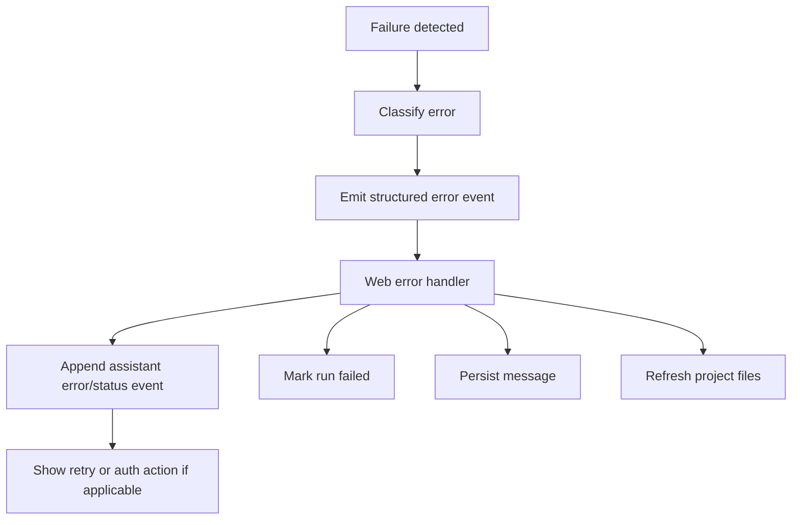

## Cancellation And Retry

Cancellation starts from the web UI but is owned by the daemon once a run exists.

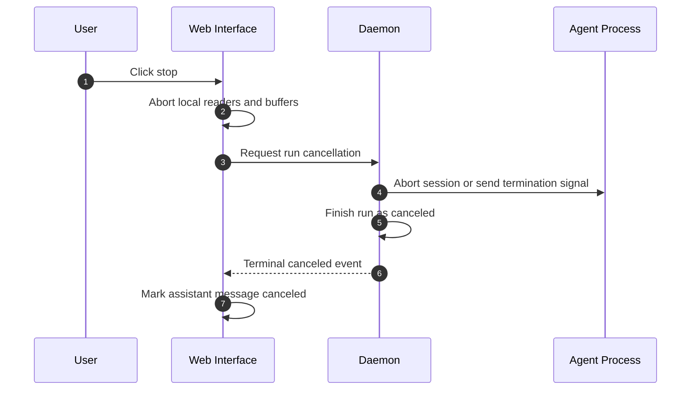

Retry is message-oriented:

1. The latest failed assistant message is identified.
2. The prior user turn is reused.
3. A new send is started with retry metadata.
4. The failed assistant row can be reused so the conversation stays coherent.

## Reattach Flow

Reattach allows a run to continue rendering after reload, navigation, or a UI
remount.

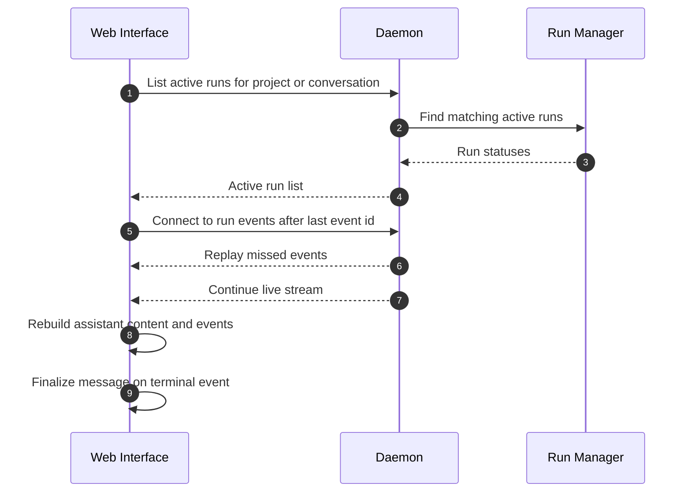

When reattach completes, the web interface refreshes project files, recovers any
artifact output, computes produced files from the pre-turn snapshot when
available, and persists the finalized assistant message.

## Portable Design Lessons

These patterns are useful outside Open Design:

- Make a chat run a first-class object with stable id, status, event replay,
  cancellation, and terminal reconciliation.
- Normalize all agent and provider streams into a small internal event protocol.
- Keep prompt assembly separate from transport and rendering.
- Keep UI tool cards separate from actual tool execution.
- Drive file preview refresh from filesystem metadata, not model prose.
- Store enough assistant event history to recover the UI after reload.
- Treat direct API mode as a separate capability profile from local-agent mode.
- Use explicit no-tools instructions when a provider path cannot execute tools.
- Persist pre-turn file snapshots so produced outputs can be computed later.
- Make cancellation go through the execution owner, not just the browser reader.
- Prefer source-of-truth state boundaries: database for messages, filesystem for
  files, run memory for active processes, React state for live UI.

